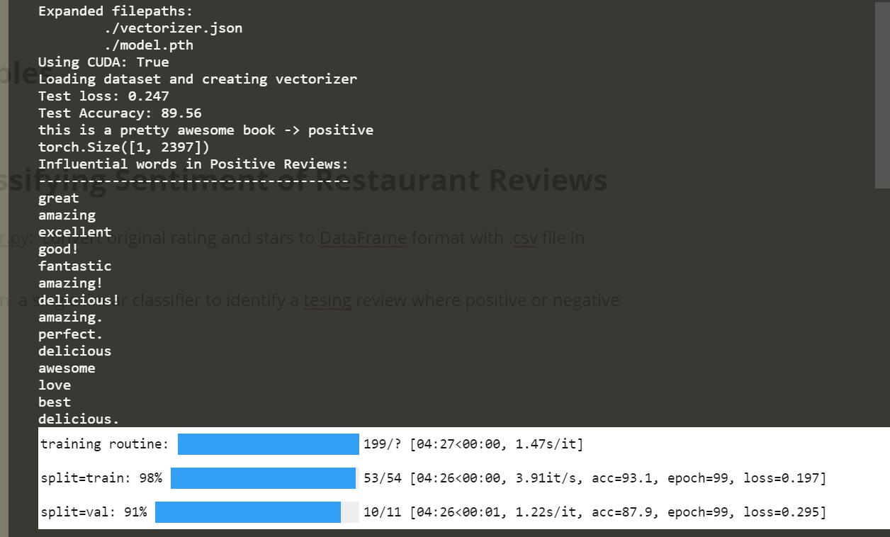

# Chapter 3

## In Text Examples

## Example: Classifying Sentiment of Restaurant Reviews

- [smallDataLoader.py](./smallDataLoader.py):  convert original rating and stars to DataFrame format with .csv file in data/review.csv
-   [main.py](./main.py): to train  a single linear classifier to identify a tesing review where positive or negative
- .ipynb: the corresponding python file with Jupyter notebook
- results metrics with 5000 items, 75% for training, 15% for validating, and 15% for testing :

|              | tain  |  val  | test  |
| :----------: | :---: | :---: | :---: |
| **Accuracy** | 93.1% | 87.9% | 89.5% |

 

#### reference：[PyTorchNLPBook](https://github.com/joosthub/PyTorchNLPBook)

